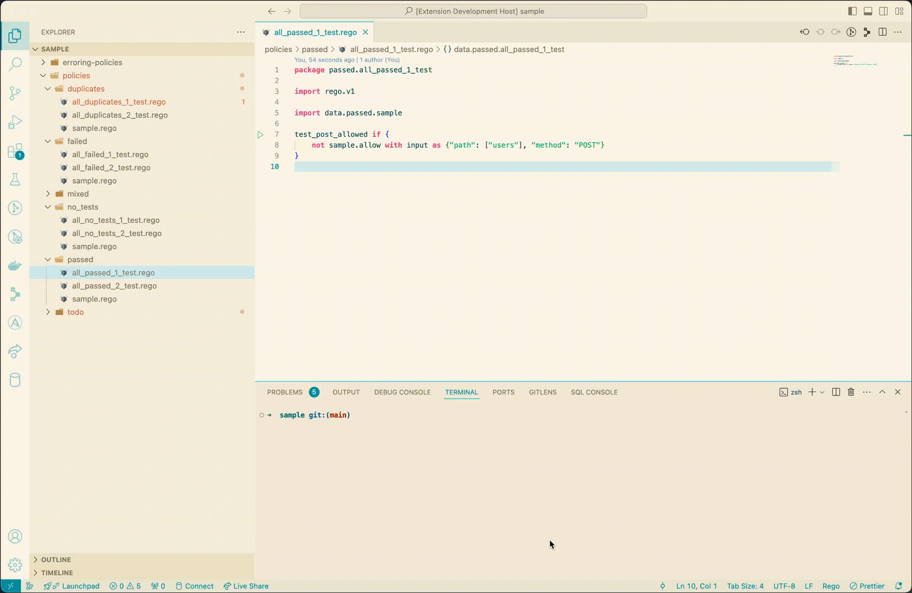

# Rego Test Runner for VS Code

🚧 Work in progress 🚧

Run [Rego tests](https://www.openpolicyagent.org/docs/latest/policy-testing/) for
[Open Policy Agent](https://www.openpolicyagent.org) within VS Code.



## Features

Simple way to run OPA Rego tests from within VS Code.

## Requirements

This plugin requires the [Open Policy Agent](https://github.com/open-policy-agent/opa) executable (`opa`) to be
installed in your $PATH.

### Installation

- [ ] To install the extension, visit the Visual Studio Code Marketplace or search for "Rego Test Runner" in the
      'Extensions' panel.

## Configuration

| Field                       | Default              | Description                                                                                    |
| --------------------------- | -------------------- | ---------------------------------------------------------------------------------------------- |
| `regoTest.policyTestDir`    | `${workspaceFolder}` | Relative folder from which to load the policy tests, defaults to the current working directory |
| `regoTest.testFilePatterns` | `["**/*_test.rego"]` | List of patterns which identify files as policy tests                                          |
| `regoTest.opaCommand`       | `opa` or `opa.exe`   | List of patterns which identify files as policy tests                                          |

## Planned features

- [ ] Automatic test discovery
- [ ] Run all tests together
- [x] Run all tests within a file
- [x] Run tests individually
- [x] Run individual tests directly from within the test file
- [ ] Erroring test output surfacing
- [ ] View test output in Rego Tests output channel
- [ ] Handle todo tests, those prefixed with `todo_`, but which must be skipped

## Other feature ideas

- [ ] Failed test output surfacing (when tests are written with
      [rego-test-assertions](https://github.com/anderseknert/rego-test-assertions))
- [ ] Code coverage

## [CHANGELOG](./CHANGELOG.md)

## Development

### Testing

Run the tests with the usual command:

```sh
npm test
```

This will run the tests with a coverage report (requires 100% across the board to pass), which you can view with:

```sh
open coverage/lcov-report/index.html
```

### Debugging

Run the `Run Extension` task in VS Code to debug the extension.
